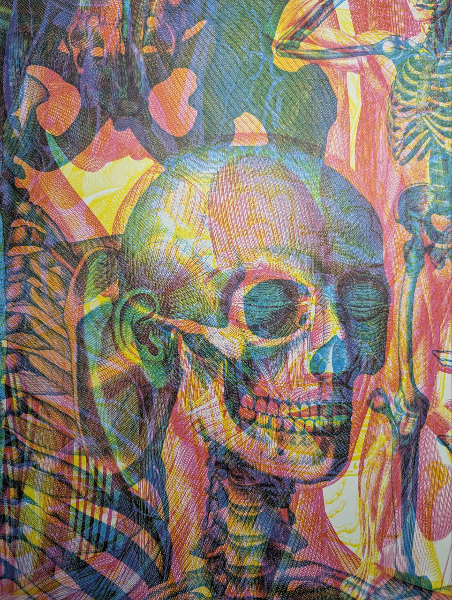
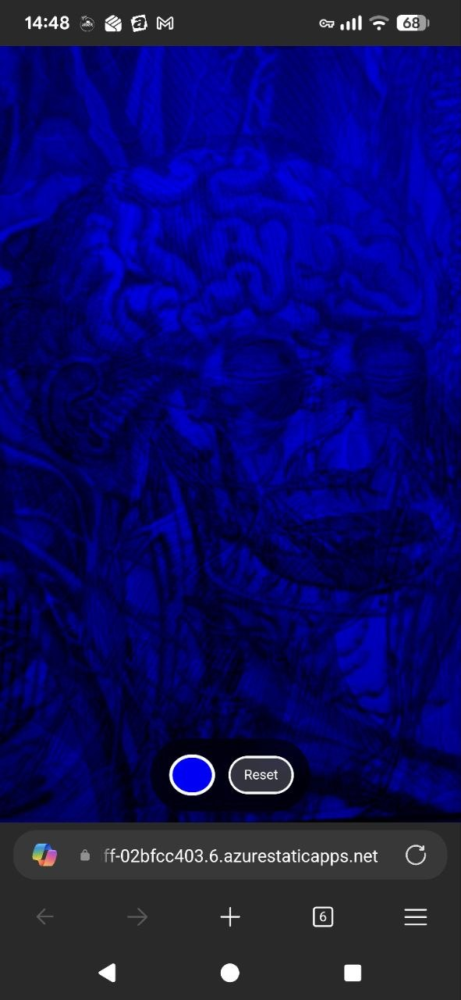

# Color Filter Camera

A simple web app that applies real-time color filters to your device's camera feed, simulating the effect of looking through colored glass.

## Features

- **Live Camera Feed** - Access your device's camera directly in the browser
- **Color Picker** - Choose any color to apply as a filter overlay
- **Real-time Filtering** - Instant filter updates as you change colors
- **Mobile Optimized** - Responsive design for phones and tablets
- **Back Camera Default** - Automatically uses the rear camera (with fallback to front)

## Demo



.jpg)
.jpg)

## Usage

1. Open the app in a browser
2. Click **"Start Camera"** and allow camera access
3. Use the color picker to select a filter color
4. Click **"Reset"** to remove the filter

## Hosting Requirements

⚠️ **This app requires HTTPS** to access the camera.

The camera API (`getUserMedia`) only works in secure contexts:
- ✅ `https://` URLs
- ✅ `localhost` / `127.0.0.1`
- ❌ `http://` (non-localhost)
- ❌ `file://` on mobile devices
- ❌ In-app browsers (Telegram, Facebook, etc.)

### Recommended Hosting Options

| Service | Setup Time | URL Format |
|---------|------------|------------|
| [Netlify Drop](https://app.netlify.com/drop) | 30 seconds | `https://random-name.netlify.app` |
| [GitHub Pages](https://pages.github.com) | 5 minutes | `https://username.github.io/repo` |
| [Vercel](https://vercel.com) | 2 minutes | `https://project.vercel.app` |
| [Cloudflare Pages](https://pages.cloudflare.com) | 3 minutes | `https://project.pages.dev` |
| [Azure Static Web Apps](https://azure.microsoft.com/products/app-service/static) | 5 minutes | `https://project.azurestaticapps.net` |

## How It Works

The color filter effect is created using CSS filters applied to the video element:

```css
filter: sepia(100%) saturate(200%) hue-rotate(Xdeg) brightness(1.2) contrast(1.1);
```

1. **Sepia** - Creates a base warm tone
2. **Saturate** - Increases color intensity
3. **Hue-rotate** - Shifts colors to match the selected color
4. **Brightness/Contrast** - Fine-tunes visibility

The hue rotation angle is calculated by converting the selected hex color to HSL and extracting the hue value.

## Browser Compatibility

| Browser | Desktop | Mobile |
|---------|---------|--------|
| Chrome | ✅ | ✅ |
| Firefox | ✅ | ✅ |
| Safari | ✅ | ✅ |
| Edge | ✅ | ✅ |

## File Structure

```
color-filter/
└── index.html    # Single-file application (HTML + CSS + JS)
```

## License

MIT License - feel free to use and modify as needed.
